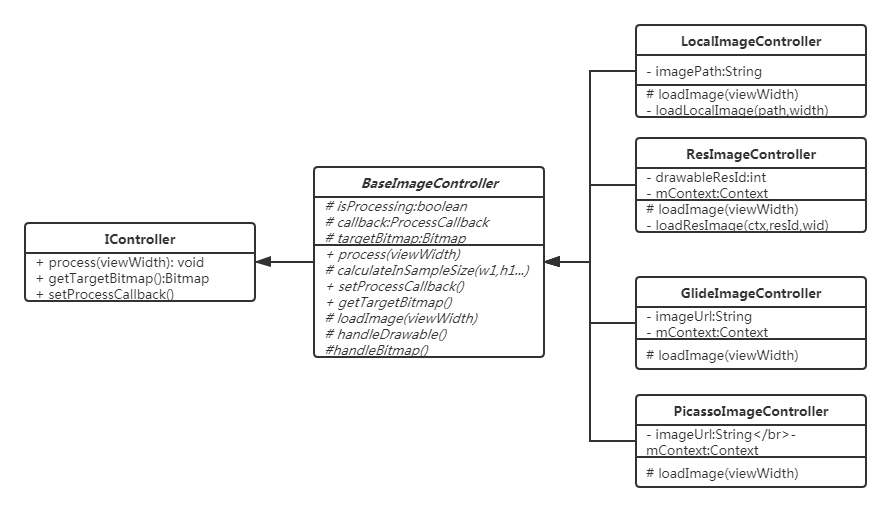

# 仿知乎列表广告栏：在RecyclerView中实现大图片完整展示的视差效果（优雅地插入全屏广告图）

github地址：https://github.com/giswangsj/RvParallaxImageView

## 一，前言

在xx地铁app(可在地铁上提供wifi)上看到过类似如下的效果：


​		在recyclerview中，某一个item位置显示广告图片，广告图是可以填充屏幕的大图，recyclerview滚动时，图片的显示区域可以跟着滚动。这个功能完美解决了：在位置空间不足的情况下展示一张完整广告图的需求。

​		于是乎就有了`RvParallaxImageView`.`RvParallaxImageView`**没有任何侵入性**，默认提供了加载resource中的drawable、和加载本地磁盘上的图片两种方式。并且提供了灵活的扩展方式，可以利用自己项目中的图片加载库进行加载。

​		比如你使用`Glide`或`Picasso`网络加载框架加载网络图片，可以使用`GlideImageController`/ `PicassoImageController`进行加载，请参看demo。

​		当然你也可以自定义Controller来使用其他图片加载框架进行加载。

​		总结：`PicassoImageController`具有使用简单，扩展方便等特点。

## 二，使用

​		为了不对你的代码由任何侵入性，`PicassoImageController`默认提供了加载res资源中的drawable和加载本地sd卡中图片两种方式。如果你需要进行网络加载，可以非常简单地自行扩展。[demo](https://github.com/giswangsj/RvParallaxImageView)中提供了`Glide`和`Picasso`两种扩展的方式。

1，首先添加依赖：

Via Gradle:

```groovy
allprojects {
    repositories {
        maven { url 'https://jitpack.io' }
    }
}

dependencies {
	implementation 'com.github.giswangsj:RvParallaxImageView:1.0.0'
}
```

2，实现recyclerview效果

​		假设你对recyclerview比较熟悉，比如有如下代码：

activity：

```kotlin
recyclerView.addItemDecoration(
    DividerItemDecoration(this,DividerItemDecoration.VERTICAL))
recyclerView.adapter = MyAdapter(recyclerView)
```

​		在adapter中根据getItemViewType设置显示不同的布局

adapter:

```kotlin
class MyAdapter(private val recyclerView: RecyclerView) : RecyclerView.Adapter<RecyclerView.ViewHolder>() {

    override fun getItemViewType(position: Int): Int {
        return if (position != 0 && position % 5 == 0) 1 else 0
    }

    override fun onCreateViewHolder(parent: ViewGroup, viewType: Int): RecyclerView.ViewHolder {
        // 根据不同type返回不同viewholder
        return if (viewType == 1) {
            val view = LayoutInflater.from(parent.context)
                .inflate(R.layout.recycler_image, parent, false)
            ImageViewViewHolder(view)
        } else {
            val view =
                LayoutInflater.from(parent.context).inflate(R.layout.recycler_item, parent, false)
            MyViewHolder(view)
        }
    }

    override fun getItemCount(): Int {
        return 25
    }

    override fun onBindViewHolder(holder: RecyclerView.ViewHolder, position: Int) {
        when (position) {
            5 -> {
                // todo 展示RvParallaxImageView
            }
            10 -> {
                // todo 展示RvParallaxImageView
            }
            else -> {
                (holder as MyViewHolder).tvTitle.text = "position:$position"
            }
        }
    }
	// 普通viewholder
    class MyViewHolder(view: View) : RecyclerView.ViewHolder(view) {
        val tvTitle = view.findViewById<TextView>(R.id.tvTitle)
    }
	// RvParallaxImageView的viewholder
    class ImageViewViewHolder(view: View) : RecyclerView.ViewHolder(view) {
        val parallaxImageView = view.findViewById<ScrollWithRvImageView>(R.id.parallaxImageView)
        val tvTitle = view.findViewById<TextView>(R.id.tvTitle)
    }
} 
```

3，加载资源中的drawable

​		`RvParallaxImageView`默认提供了加载资源中的drawable的方式，通过对`parallaxImageView`绑定recyclerview并设置`ResImageController`来实现。代码如下：

```kotlin
override fun onBindViewHolder(holder: RecyclerView.ViewHolder, position: Int) {
    when (position) {
        5 -> {      // 资源图
            (holder as ImageViewViewHolder).parallaxImageView.apply {
                bindRecyclerView(recyclerView)
                setController(ResImageController(context, R.mipmap.girl))
            }
            holder.tvTitle.text = "加载资源图:R.mipmap.girl"
        }
        ...
    }
}
```

4，加载本地sd卡中的图片

​		同上，RvParallaxImageView默认也提供了加载本地sd卡中的图片的方式，通过对`parallaxImageView`绑定recyclerview并设置`LocalImageController`来实现。代码如下：

```kotlin
override fun onBindViewHolder(holder: RecyclerView.ViewHolder, position: Int) {
    when (position) {
    	...
        10 -> {     // 本地图
            val imagePath = pathPrefix + "a0.jpg";
            (holder as ImageViewViewHolder).parallaxImageView.apply {
                bindRecyclerView(recyclerView)
                setController(LocalImageController(imagePath))
            }
            holder.tvTitle.text = "加载本地图: /sdcard/a0.jpg"
        }
        ...
    }
}
```

> 注意，此处需要申请读sd卡权限


## 三，加载网络图片

​		1，自定义ImageController

​		如需加载网络图片需要自定义`ImageController`，这个过程也非常简单：首先新建class继承自`BaseImageController`，实现`loadImage`方法，然后在`loadImage`中利用图片加载库获取bitmap或drawable，然后调用`handleBitmap`或`handleDrawable`方法即可。

​		如demo中的[GlideImageController](https://github.com/giswangsj/RvParallaxImageView/blob/master/app/src/main/java/per/wsj/rvparallaximageview/controller/GlideImageController.java):

```
public class GlideImageController extends BaseImageController {
    private Context mContext;
    private String imageUrl;
    public GlideImageController(Context context, String imageUrl) {
        this.mContext = context;
        this.imageUrl = imageUrl;
    }

    @Override
    protected void loadImage(int viewWidth) {
        // 利用Glide获取drawable
        Glide.with(mContext).load(imageUrl).into(new SimpleTarget<Drawable>() {
            @Override
            public void onResourceReady(Drawable resource, Transition<? super Drawable> transition) {
                // 处理drawable
                handleDrawable(viewWidth, resource);
            }
        });
    }
}
```

​		2，使用

​		定义好`ImageController`后使用起来也非常简单如下：

```kotlin
override fun onBindViewHolder(holder: RecyclerView.ViewHolder, position: Int) {
    when (position) {
        15 -> {     // Glide加载
            val imageUrl = "http://gitstar.com.cn:8000/static/img/1.jpg"
            (holder as ImageViewViewHolder).parallaxImageView.apply {
                bindRecyclerView(recyclerView)
                setController(GlideImageController(context, imageUrl))
            }
        }
        20 -> {     // picasso加载
            val imageUrl = "http://gitstar.com.cn:8000/static/img/6.jpg"
            (holder as ImageViewViewHolder).parallaxImageView.apply {
                bindRecyclerView(recyclerView)
                setController(PicassoImageController(context, imageUrl))
            }
        }
    }
}
```

​		

## 四，实现原理

​		**1，核心思想**

​		这种视差效果的核心思想是怎样的呢？

​		如下图，假设黑色区域是recyclerview，红色区域是item，黄色区域是图片。此时item的底部正好在recyclerview的底部，item展示的也是图片的底部。根据我们的逻辑在item滚动到recyclerview顶部时图片也刚好滚动到item的顶部，因此就存在了一个滚动中的缩放因子。


​		那么这个缩放因子怎么计算呢？

​		上图中`h1`是图片未在item中展示的高度，`h2`是item距离recyclerview顶部的距离，要想让item走完`h2`的距离时，image走完`h1`的距离，那么这个缩放因子就是`scaleFactor = h1/h2`。recyclerview在滚动中移动的距离`dy*scaleFactor`也就是图片移动的距离。

​		**2，ImageController**

​		ImageController是用来加载图片，对图片进行缩放处理，并提供处理后bitmap给`RvParallaxImageView`的控制器。其结果如下图所示，主要有接口`IController`，抽象类`BaseImageController`和几种加载图片方式的实现类，如需扩展请继承`BaseImageController`。



​		`BaseImageController`中提供了对Drawable和Bitmap进行缩放处理方法，因此其子类中只需要获取到Drawable或Bitmap交给父类来处理即可。

​		**3，RvParallaxImageView**

​		`RvParallaxImageView`是一个自定义view，其绘制的图片来源于`ImageController`，图片的视差移动效果由recyclerview滚动来决定。

​		3.1 setController

​		使用`RvParallaxImageView`时需要对其设置`Controller`，然后需要`Controller`添加`ProcessCallback`就是处理完成后的回调，回调结果返回了图片缩放后的宽高。

​		根据图片的高度以及当前view的高度可以计算出上文的`h1`，根据当前view的高度以及recyclerview的高度可以计算出上文的`h2`，因此可以在此时计算出`scaleFactor `的值。

```java
public void setController(IController controller) {
	mImageController = controller;
	mImageController.setProcessCallback(new ProcessCallback() {
		@Override
		public void onProcessFinished(int width, int height) {
			isScaled = true;
			resetScaleFactor(height);
			getLocationInWindow(viewLocation);
			topOffscreen = -(viewLocation[1] - rvLocation[1]) * scaleFactor;
			bindTopOrBottom();
			// 当前是非ui线程
			postInvalidate();
		}
	});
}
```

​		3.2，bindRecyclerView

​		从使用中可以发现`RvParallaxImageView`绑定了RecyclerView，并监听RecyclerView的滚动，根据滚动的位置以及缩放因子`scaleFactor `计算出`topOffscreen`来确定图片顶部展示的位置，图片顶部展示的位置也就决定了图片在视图中显示的区域。

```java
public void bindRecyclerView(RecyclerView recyclerView) {
	if (recyclerView == null || recyclerView.equals(this.recyclerView)) {
		return;
	}
	unbindRecyclerView();
	this.recyclerView = recyclerView;
	rvLocation = new int[2];
	rvHeight = recyclerView.getLayoutManager().getHeight();
	recyclerView.getLocationInWindow(rvLocation);
	recyclerView.addOnScrollListener(rvScrollListener = new RecyclerView.OnScrollListener() {
		@Override
		public void onScrollStateChanged(RecyclerView recyclerView, int newState) {
			super.onScrollStateChanged(recyclerView, newState);
		}

		@Override
		public void onScrolled(RecyclerView recyclerView, int dx, int dy) {
			super.onScrolled(recyclerView, dx, dy);
			int topDistance = getTopDistance();
			if (topDistance > 0 && topDistance + viewHeight < rvHeight) {
				topOffscreen += dy * scaleFactor;
				bindTopOrBottom();
				if (isMeasured) {
					invalidate();
				}
			} else if (topDistance + viewHeight >= rvHeight) {
				// view还未显示出来就执行process回调，因此会出现view在底部图片置顶的情况
				if (topOffscreen == 0) {
					if (isScaled) {
						getLocationOnScreen(viewLocation);
						topOffscreen = -(viewLocation[1] - rvLocation[1]) * scaleFactor;
						bindTopOrBottom();
						invalidate();
					}
				}
			}
		}
	});
}
```

​			3.3 onDraw()

​		最后在`onDraw()`中根据`topOffscreen`绘制bitmap，实现图片展示：

```
protected void onDraw(Canvas canvas) {
	super.onDraw(canvas);
	Bitmap bitmap = mImageController.getTargetBitmap();
	if (bitmap == null || bitmap.isRecycled()) {
		return;
	}
	canvas.drawBitmap(bitmap, 0, topOffscreen, null);
}
```

> topOffscreen可以理解为滚动中实时变动的h1的值


​		github地址：https://github.com/giswangsj/RvParallaxImageView 欢迎star

​		最后给出res/sdcard/glide/picasso四种方式的效果图：


